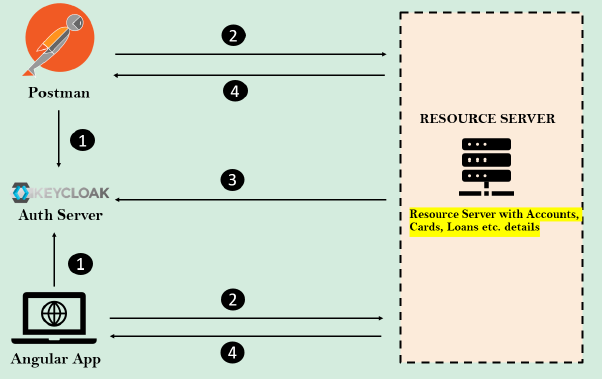
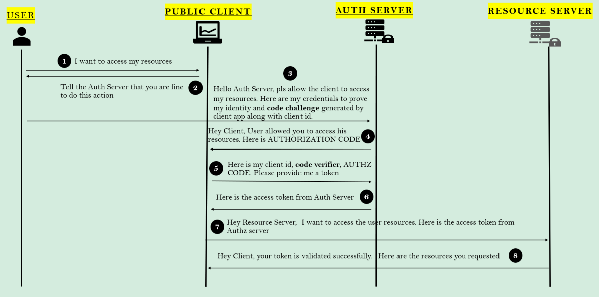

# Implementing OAuth2 style Login inside EazyBank using KeyCloak

### Implementação de OAuth2 dentro do aplicativo EazyBank usando o servidor de autorização Keycloak

1. Podemos ter um aplicativo cliente como Angular ou clientes de API REST para obter os detalhes do recurso do servidor
   de recursos. Em ambos os tipos, precisamos obter o token de acesso de servidores de autorização como o Keycloak.
2. Uma vez recebido o token de acesso do servidor de autorização, os aplicativos clientes se conectarão com o servidor
   de recursos junto com o token de acesso para obter detalhes sobre contas, cartões, empréstimos etc.
3. O servidor de recursos se conectará ao servidor de autorização para saber a validade do token de acesso
4. Se o token de acesso for válido, o servidor de recursos responderá com os detalhes aos aplicativos clientes.

### Fluxo de código de autorização OAuth2 com prova de chave para troca de código (PKCE)

PKCE: Proof Key For Code Exchange

Quando clientes públicos (por exemplo, aplicativos nativos e de página única) solicitam tokens de acesso, algumas
preocupações de segurança adicionais são apresentadas que não são mitigadas apenas pelo fluxo de código de autorização.
Isso ocorre porque os clientes públicos não podem armazenar com segurança um segredo do cliente.

Dadas essas situações, o OAuth 2.0 fornece uma versão do Fluxo de Código de Autorização para aplicativos clientes
públicos que utiliza uma Prova de Chave para Troca de Código (PKCE).

O Fluxo de Código de Autorização aprimorado por PKCE segue as etapas abaixo:

* Depois que o usuário clica em login, o aplicativo cliente cria um code_verifier criptograficamente aleatório e a
  partir dele gera um code_challenge.
* O desafio de código é uma string codificada em Base64-URL do hash SHA256 do verificador de código.
* Redireciona o usuário para o servidor de autorização junto com o code_challenge.
* O servidor de autorização armazena o code_challenge e redireciona o usuário de volta para o aplicativo com um código
  de autorização, válido para um uso.
* O aplicativo cliente envia o código de autorização e o code_verifier (criado na etapa 1) para o servidor de
  autorização.
* O servidor de autorização verifica o code_challenge e o code_verifier. Se forem válidos, ele responde com ID Token e
  Access Token (e opcionalmente, um Refresh Token).

### Fluxo OAuth2 com Código de Autorização e PKCE (Proof Key for Code Exchange)

1. **User to Public Client**: Desejo acessar meus recursos.
2. **Public Client to User**: Solicite ao servidor de autorização que você permite esta ação.
3. **User to Auth Server**: HOlá Servidor de Autorização, permita que o cliente acesse meus recursos. Aqui estão minhas
   credenciais para provar minha identidade e o **código de desafio** gerado pelo aplicativo cliente junto com o ID do
   cliente.
4. **Auth Server to Public Client**: Olá Cliente, o usuário permitiu que você acessasse seus recursos. Aqui está o
   CÓDIGO DE AUTORIZAÇÃO (AUTHORIZATION CODE).
5. **Public Client to Auth Server**: Aqui estão meu ID de cliente, verificador de código, CÓDIGO DE AUTORIZAÇÃO (AUTHZ
   CODE). Por favor, forneça-me um token.
6. **Auth Server to Public Client**: Aqui está o token de acesso do Servidor de Autorização.
7. **Public Client to Resource Server**: Olá servidor de recursos, quero acessar os recursos do usuário. Aqui está o
   token de acesso do Servidor de Autorização.
8. **Resource Server to Public Client**: Olá Cliente, seu token foi validado com sucesso. Aqui estão os recursos
   solicitados.

Nas etapas 2 e 3, onde o cliente faz uma solicitação ao endpoint do Servidor de Autorização, ele deve enviar os
seguintes detalhes importantes:

* **client_id**: a identificação do aplicativo cliente pelo Servidor de Autorização. Isso será concedido quando o
  cliente se registrar pela primeira vez com o servidor de autorização.
* **redirect_uri**: o valor do URI para o qual o servidor de autorização precisa redirecionar após a autenticação
  bem-sucedida. Se um valor padrão for fornecido durante o registro, esse valor é opcional.
* **scope**: semelhante às autoridades. Especifica o nível de acesso que o cliente está solicitando, como LEITURA (
  READ).
* **state**: valor do token CSRF para proteção contra ataques CSRF
* **response_type**: com o valor 'code' que indica que queremos seguir a concessão de código de autorização.
* **code_challenge**: XXXXXXXX - O código de desafio gerado conforme descrito anteriormente.
* **code_challenge_method**: S256 (either plan ou S256).

Na etapa 5, onde o cliente, após receber um código de autorização do Servidor de Autorização, fará novamente uma
solicitação ao servidor de autorização para um token com os seguintes valores:

* **code**: o código de autorização recebido das etapas anteriores.
* **client_id** & **client_secret** (opcional): as credenciais do cliente registradas no servidor de autorização.
  Observe que essas não são credenciais do usuário.
* **grant_type**: com o valor 'authorization_code' que identifica o tipo de concessão usada.
* **redirect_uri**
* **code_verifier**: o verificador de código para a solicitação PKCE, que o aplicativo gerou originalmente antes da
  solicitação de autorização.

---

username: admin
password: admin123

Client Secret: ioabAQA6hsouVtxk1HkYiXZHN168TNrv