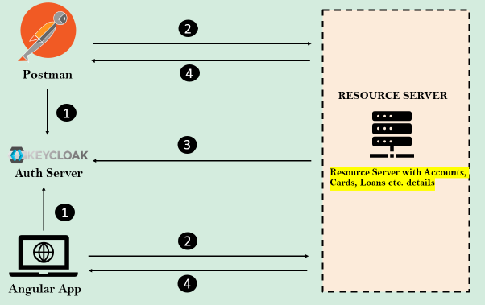
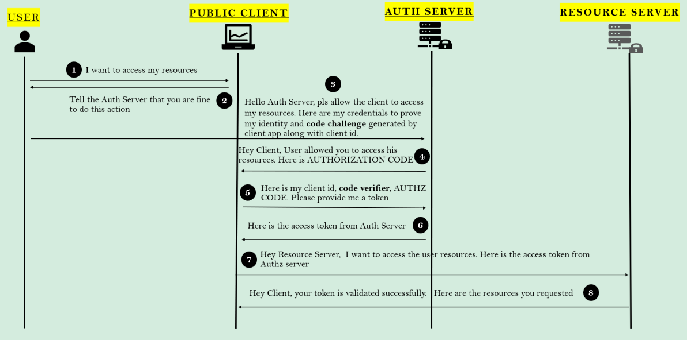

# Implementing OAuth2 style Login inside EazyBank using KeyCloak

### Implementação de OAuth2 dentro do aplicativo EazyBank usando o servidor de autorização Keycloak

1. Podemos ter um aplicativo cliente como Angular ou clientes de API REST para obter os detalhes do recurso do servidor
   de recursos. Em ambos os tipos, precisamos obter o token de acesso de servidores de autorização como o Keycloak.
2. Uma vez recebido o token de acesso do servidor de autorização, os aplicativos clientes se conectarão com o servidor
   de recursos junto com o token de acesso para obter detalhes sobre contas, cartões, empréstimos etc.
3. O servidor de recursos se conectará ao servidor de autorização para saber a validade do token de acesso
4. Se o token de acesso for válido, o servidor de recursos responderá com os detalhes aos aplicativos clientes.

### Fluxo de código de autorização OAuth2 com prova de chave para troca de código (PKCE)

PKCE: Proof Key For Code Exchange

Quando clientes públicos (por exemplo, aplicativos nativos e de página única) solicitam tokens de acesso, algumas
preocupações de segurança adicionais são apresentadas que não são mitigadas apenas pelo fluxo de código de autorização.
Isso ocorre porque os clientes públicos não podem armazenar com segurança um segredo do cliente.

Dadas essas situações, o OAuth 2.0 fornece uma versão do Fluxo de Código de Autorização para aplicativos clientes
públicos que utiliza uma Prova de Chave para Troca de Código (PKCE).

O Fluxo de Código de Autorização aprimorado por PKCE segue as etapas abaixo:

* Depois que o usuário clica em login, o aplicativo cliente cria um code_verifier criptograficamente aleatório e a
  partir dele gera um code_challenge.
* O desafio de código é uma string codificada em Base64-URL do hash SHA256 do verificador de código.
* Redireciona o usuário para o servidor de autorização junto com o code_challenge.
* O servidor de autorização armazena o code_challenge e redireciona o usuário de volta para o aplicativo com um código
  de autorização, válido para um uso.
* O aplicativo cliente envia o código de autorização e o code_verifier (criado na etapa 1) para o servidor de
  autorização.
* O servidor de autorização verifica o code_challenge e o code_verifier. Se forem válidos, ele responde com ID Token e
  Access Token (e opcionalmente, um Refresh Token).

### OAuth2 Auth Code Flow with Proof Key for Code Exchange (PKCE)

1. **User to Public Client**: I want to access my resources.
2. **Public Client to User**: Tell the Auth Server that you are fine to do this action.
3. **User to Auth Server**: Hello Auth Server, please allow the client to access my resources. Here are my credentials
   to prove my identity and **code challenge** generated by client app along with client id.
4. **Auth Server to Public Client**: Hey Client, User allowed you to access his resources. Here is AUTHORIZATION CODE.
5. **Public Client to Auth Server**: Here is my client id, **code verifier**, AUTHZ CODE. Please provide me a token.
6. **Auth Server to Public Client**: Here is the access token from Auth Server.
7. **Public Client to Resource Server**: Hey resource server, I want to access the user resources Here is the access
   token from Authz Server.
8. **Resource Server to Public Client**: Hey Client, your token is validated successfully. Here are the resources you
   requested.

In the steps 2 & 3, where client is making a request to Auth Server enpoint have to send the below important details:

* **client_id**: 
* **redirect_uri**:
* **scope**:
* **state**:
* **response_type**:
* **code_challenge**:
* **code_challenge_method**:

In the step 5 where client after receive a authorization code from Auth Server, it will 