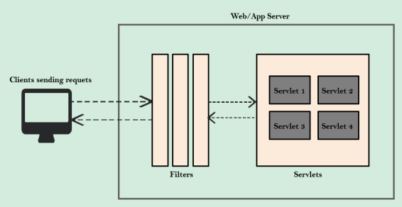
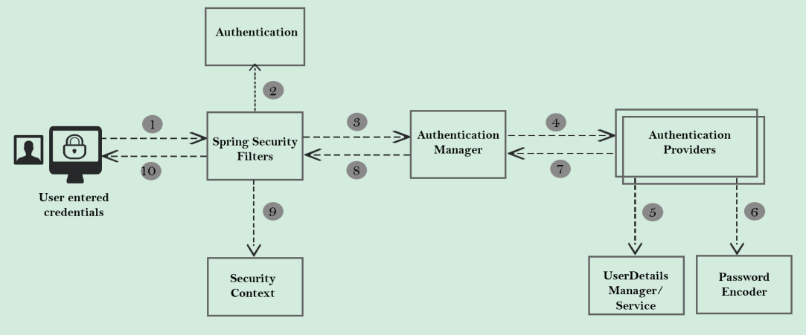
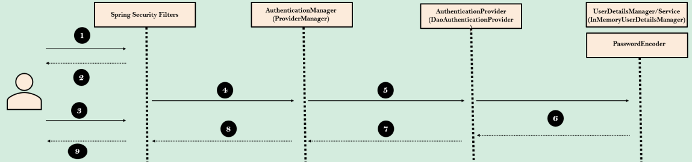
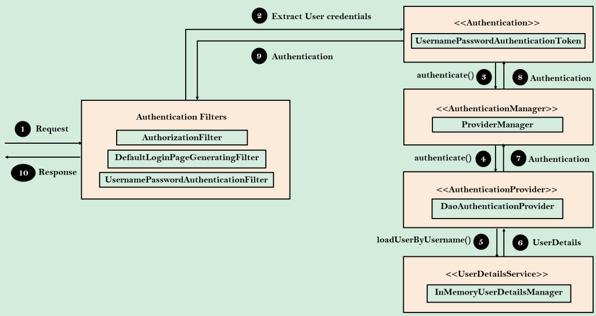

# Spring Security 6.1 & Spring Boot 3.1.0

## INTORUDÇÇÃO

### Spring Security

Perguntas frequentes sobre Segurança

* **Security** (segurança): Como posso implementar segurança em meus aplicativos web/mobile para que não haja falhas de
  segurança?
* **Passwords** (senha): Como armazenar senhas, validá-las, codificá-las e decodificá-las usando algoritmos de
  criptografia padrão da indústria?
* **Users & Roles** (usuários e perfis): Como manter a segurança baseada no nível do usuário, de acordo com seus papéis
  e concessões associadas?
* **Multiple Logins** (Logins múltiplos): Como implementar um mecanismo onde o usuário faça login apenas uma vez e
  comece a usar meu aplicativo?
* **Fine Grained Security** (Segurança Granular): Como implementar segurança em cada nível do meu aplicativo usando
  regras de autorização?
* **CSRF & CORS**: O que são ataques CSRF e restrições CORS. Como superá-los?
* **JWT & OAuth2**: O que são JWT e OAuth2. Como posso proteger meu aplicativo web usando-os?
* **Preventing Attacks** (Prevenção de ataques): Como prevenir ataques de segurança como força bruta, roubo de dados,
  fixação de sessão.

### Introdução à Segurança

**O que e Por quê**

* Você já observou como os bancos são bem protegidos?
* Por que os bancos são bem protegidos? Porque eles guardam ativos valiosos dentro deles.
* Semelhante aos bancos, nossos aplicativos web também contêm dados valiosos. Então, por que não protegê-los?
* Você não acha que todos os hackers roubarão os dados se o aplicativo web não estiver devidamente protegido?
* O que é Segurança?
    * Segurança é para proteger seus dados e lógica de negócios dentro de seus aplicativos web.
* A segurança é um requisito não funcional
    * A segurança é tão importante quanto escalabilidade, desempenho e disponibilidade. Nenhum cliente pedirá
      especificamente que eu preciso de segurança.
* Segurança desde a fase de desenvolvimento
    * A segurança deve ser considerada desde a fase de desenvolvimento, juntamente com a lógica de negócios.
* Diferentes tipos de segurança
    * A segurança para um aplicativo web será implementada de diferentes maneiras, como usando firewalls, HTTPS, SSL,
      autenticação, autorização etc.
* Por que a segurança é importante?
    * Segurança não significa apenas perder dados ou dinheiro, mas também a marca e a confiança de seus usuários que
      você construiu ao longo dos anos.
* Evitando ataques mais comuns
    * Ao utilizar a segurança, também devemos evitar ataques de segurança mais comuns, como CSRF e autenticação
      incorreta dentro de nosso aplicativo.

**Por que Spring Security?**

A segurança de aplicativos não é divertida e é desafiadora de implementar com nosso código/framework personalizado.

O Spring Security é construído por uma equipe da Spring especializada em segurança, considerando todos os cenários de
segurança. Ao usar o Spring Security, podemos proteger aplicativos web com configurações mínimas. Portanto, não há
necessidade de reinventar a roda.

O Spring Security lida com vulnerabilidades de segurança comuns, como CSRF e CORS. Para qualquer vulnerabilidade de
segurança identificada, o framework será corrigido imediatamente, pois é usado por muitas organizações.

Usando o Spring Security, podemos proteger nossas páginas/caminhos de API, impor funções, segurança de nível de método
etc. facilmente com configurações mínimas.

O Spring Security suporta vários padrões de segurança para implementar a autenticação, como autenticação usando nome de
usuário/senha, tokens JWT, OAuth2, OpenID etc.

**Servlets e Filtros**

* Cenário típico dentro de um aplicativo web
    * Em aplicativos web Java, o Servlet Container (Servidor Web) se encarrega de traduzir as mensagens HTTP para o
      código Java entender. Um dos contêineres de servlet mais usados é o Apache Tomcat. O Servlet Container converte a
      mensagem HTTP em `ServletRequest` e a entrega ao método Servlet como um parâmetro. Da mesma forma,
      `ServletResponse` retorna como uma saída do Servlet para o Servlet Container. Portanto, tudo o que escrevemos
      dentro de aplicativos web Java é controlado por Servlets.
* Função dos Filtros
    * Filtros dentro de aplicativos web Java podem ser usados para interceptar cada request/response (solicitação /
      resposta) e fazer algum trabalho preliminar antes de nossa lógica de negócios. Então, usando os mesmos filtros, o
      Spring Security impõe a segurança com base em nossas configurações dentro de um aplicativo web.

**Fluxo interno do Spring Security**

1. Usuário insere suas credenciais.
2. **Spring Security Filters** (Filtros Spring Security): Uma série de filtros intercepta cada requisição e trabalha em
   conjunto para identificar se a autenticação é necessária. Se a autenticação for exigida, o usuário será direcionado
   para a página de login ou serão utilizadas as credenciais armazenadas durante a autenticação inicial.
3. `Authentication` (Autenticação): Filtros como `UsernameAuthenticationFilter` extraem o nome de usuário e a senha da
   requisição HTTP e preparam um objeto do tipo `Authentication`. A interface `Authentication` é o padrão central para
   armazenar detalhes do usuário autenticado dentro do framework Spring Security.
4. `SecurityContext` (Contexto de Segurança): Uma vez que a requisição foi autenticada, a `Authentication` geralmente é
   armazenada em um `SecurityContext` local de thread gerenciado pelo `SecurityContextHolder`. Isso auxilia nas próximas
   requisições do mesmo usuário.
5. `AuthenticationManager` (Gerenciador de Autenticação): Ao receber a requisição do filtro, ele delega a validação dos
   detalhes do usuário aos provedores de autenticação disponíveis. Como pode haver vários provedores dentro de um
   aplicativo, é responsabilidade do `AuthenticationManager` gerenciar todos os provedores de autenticação disponíveis.
6. `AuthenticationProvider` (Provedor de Autenticação): Possui toda a lógica central de validação dos detalhes do
   usuário para autenticação.
7. `UserDetailsManager` e `UserDetailsService`:  Auxiliam na recuperação, criação, atualização e exclusão
   dos `UserDetails` do banco de dados ou sistemas de armazenamento.
8. `PasswordEncoder` (Codificador de Senha): Interface de serviço que ajuda na codificação e hash de senhas. Caso
   contrário, teríamos que lidar com senhas em texto puro.

**Fluxo Sequencial**

Comportamento padrão do Spring Security

1. Usuário tenta acessar uma página segura pela primeira vez.
2. Nos bastidores, alguns filtros como `AuthorizationFilter`, `DefaultLoginPageGeneratingFilter` identificam que o
   usuário não está logado e o redireciona para a página de login.
3. O usuário insere suas credenciais e a requisição é interceptada pelos filtros.
4. Filtros como `UsernamePasswordAuthetnicationFilter` extraem o nome de usuáiro e a senha da requisição e constroem um
   objeto `UsernamePasswordAuthenticationToken`, que é uma implementação da interface `Authentication`. Com o objeto
   criado, ele invoca o método `authenticate()` do `ProviderManager`.
5. O `ProviderManager`, que é uma implementação do `AuthenticationManager`, identifica a lista de provedores de
   autenticação disponíveis que suportam o estilo do objeto de autenticação fornecido. No comportamento padrão, o
   método `authenticate()` do `DaoAuthenticationProvider` será invocado pelo `ProviderManager`.
6. O `DaoAuthenticationProvider` invoca o método `loadUserByUsername()` do `ApiUserDetails` para carregar os detalhes do
   usuário. Uma vez os detalhes do usuário carregados, ele utiliza a implementação padrão de codificação de senha para
   comparar a senha e validar se o usuário é autenticado ou não.
7. Por fim, ele retorna o objeto `Authentication` com os detalhes de sucesso ou falha da autenticação para
   o `ProviderManager`.
8. O `ProviderManager` verifica se a autenticação foi bem-sucedida ou não. Se não, ele tentará com
   outros `AuthenticationProviders` disponíveis. Caso contrário, ele simplesmente retorna os detalhes de autenticação
   para os filtros.
9. O objeto `Authentication` é armazenado no objeto `SecurityContext` pelo filtro para uso futuro e a resposta é
   retornada ao usuário final.

