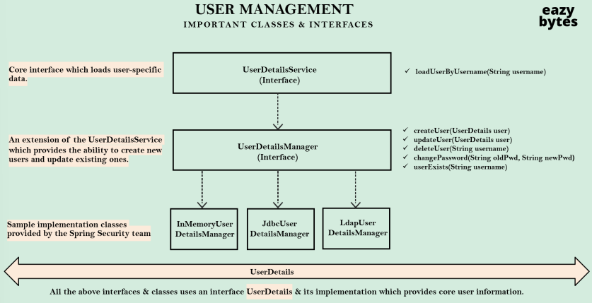

### Configurando Usuários utilizando `InMemoryUserDetailsManager`

Observação: Não é recomendado utilizar em produção.

Ao invés de definir um único usuário dentro do application.yaml, como próximo passo, podemos definir vários usuários
junto com suas autorizações com a ajuda do `InMemoryUserDetailsManager` e `UserDetails`.

* A Abordagem 1 usa o método `withDefaultPasswordEncoder()` para criar os detalhes do usuário.

```java

import org.springframework.security.core.userdetails.User;
import org.springframework.security.core.userdetails.UserDetails;
import org.springframework.security.provisioning.InMemoryUserDetailsManager;

@Configuration
public class SecurityConfig {

	/**
	 * Approach 1 where we use `withDefaultPasswordEncoder()` method while creating the user details.
	 * InMemoryUserDetailsManager: Gerador de usuários em memória
	 * UserDetails: detalhes do usuário
	 * withDefaultPasswordEncoder(): com codificador de senha padrão
	 */
	@SuppressWarnings("deprecation")
	@Bean
	public InMemoryUserDetailsManager userDetailsManager() {

		UserDetails admin = User.withDefaultPasswordEncoder()
				.username("admin") // nome do usuário
				.password("12345") // senha
				.authorities("admin") // authoridades (permissões do usuário)
				.build(); // constrói o objeto UserDetails

		UserDetails user = User.withDefaultPasswordEncoder()
				.username("user") // nome do usuário
				.password("12345") // senha
				.authorities("read") // permissão leitura
				.build(); // constrói o objeto UserDetails

		return new InMemoryUserDetailsManager(admin, user);

	}

}
```

* A Abordagem 2 utiliza o `NoOpPasswordEncoder` `Bean` ao criar os detalhes do usuário.

**Observação**: É importante ressaltar que o `NoOpPasswordEncoder` NÃO É SEGURO para ambientes de produção. Ele armazena
as senhas como plain text, o que as torna vulneráveis a ataques. Use esta abordagem apenas para fins de desenvolvimento
ou demonstração.

```java

@Configuration
public class SecurityConfig {

	@Bean
	public InMemoryUserDetailsManager userDetailsManager() {

		UserDetails admin = User.withUsername("admin") // nome do usuário
				.password("12345") // senha
				.authorities("admin") // authoridades (permissões do usuário)
				.build(); // constrói o objeto UserDetails

		UserDetails user = User.withUsername("user") // nome do usuário
				.password("12345") // senha
				.authorities("read") // permissão leitura
				.build(); // constrói o objeto UserDetails

		return new InMemoryUserDetailsManager(admin, user);

	}

	@SuppressWarnings("deprecation")
	@Bean
	public PasswordEncoder passwordEncoder() {
		return NoOpPasswordEncoder.getInstance();
	}
}
```

### Fluxo Interno do Spring Security


### Gerenciamento de Usuários

Classes e interfaces importantes



* `UserDetailsService` (interface): Interface principal que carrega dados específicos do usuário.
    * `loadUserByUsername(String username)`
* `UserDetailsManager` (interface): Uma extensão do `UserDetailsService` que fornece a capacidade de criar novos
  usuários e atualizar usuários existentes.
    * `createUser(UserDetails user)`
    * `updateUser(UserDetails user)`
    * `deleteUser(String username)`
    * `changePassword(String oldPwd, String newPwd)`
    * `userExists(String username)`
* `InMemoryUserDetailsManager`, `JdbcUserDetailsManager` e `LdapUserDetailsManager`: Classes de implementação de exemplo
  fornecidas pela equipe Spring Security.
* `UserDetails`: Todas as interfaces e classes acima usam uma interface `UserDetails` e sua implementação, que fornece
  informações básicas do usuário.

### Relação entre UserDetails & Authentication


Por que temos duas maneiras separadas de armazenar detalhes do usuário logado?

* `Principal` (interface)
* `Authentication` (interface)
* `UsernamePassowrdAuthenticationToken` (class)
    * `getName()`
    * `getPrincipal()`
    * `getAuthorities()`
    * `getCredentials()`
    * `getDetails()`
    * `isAuthenticated()`
    * `setAuthenticated()`
    * `eraseCredentials()`

`Authentication` é o tipo de retorno em todos os cenários em que estamos tentando determinar se a autenticação foi
bem-sucedida ou não. Por exemplo, dentro do `AuthenticationProvider` e `AuthenticationManager`.

* `UserDetails` (interface)
* `User` (class)
    * `getPassword()`
    * `getUsername()`
    * `getAuthorities()`
    * `isAccountNonExpired()`
    * `isAccountNonLocked()`
    * `isEnabled()`
    * `isCredentialsNonExpired()`
    * `eraseCredentials()`

`UserDetails` é o tipo de retorno em todos os cenários em que tentamos carregar as informações do usuário dos sistemas
de armazenamento. Por exemplo, dentro do `UserDetailsService` e `UserDetailsManager`

### Autenticação usando `JdbcUserDetailsManager`

Em vez de criar usuários na memória do servidor web, podemos armazená-los em um banco de dados e, com a ajuda
do `JdbcUserDetailsManager`, podemos realizar a autenticação.

Observe que é necessário criar uma tabela de acordo com a classe `JdbcUserDetailsManager` e inserir registros de usuário
nela. `NoOpPasswordEncoder` não é recomendado para aplicativos de produção.

```java
public class SecurityConfig {

	public UserDetailsService userDetailsService(DataSource dataSource) {
		return new JdbcUserDetailsManager(dataSource);
	}

	@Bean
	public PasswordEncoder passwordEncoder() {
		return NoOpPasswordEncoder.getInstance();
	}

}

```

### Implementação de `UserDetailsService` para lógica de busca de usuário personalizada

Quando queremos carregar os detalhes do usuário com base em nossas próprias tabelas, colunas e lógica personalizada,
precisamos criar um bean que implemente `UserDetailsService` e sobrescrever o método `loadUserByUsername()`.

```java
public class ApiUserDetails implements UserDetailsService {

	@Override
	public UserDetails loadUserByUsername(String username) throws UsernameNotFoundException {

		String userName, password;
		List<GrantedAuthority> authorities;
		Optional<Customer> customer = customerRepository.findByEmail(username);

		if (customer.isPresent()) {
			throw new UsernameNotFoundException("User details not found for the user : " + username);
		} else {
			userName = customer.get().getEmail();
			password = customer.get().getPwd();
			authorities = new ArrayList<>();
			authorities.add(new SimpleGrantedAuthority(customer.get().getRole()));
		}

		return new User(userName, password, authorities);

	}

}
```

### Fluxo Sequencial com nossa própria implementação `UserDetailsService`


1. Usuário tenta acessar uma página segura pela primeira vez.
2. Nos bastidores, alguns filtros como `AuthorizationFilter`, `DefaultLoginPageGeneratingFilter` identificam que o
   usuário não está logado e o redireciona para a página de login.
3. O usuário insere suas credenciais e a requisição é interceptada pelos filtros.
4. Filtros como `UsernamePasswordAuthetnicationFilter` extraem o nome de usuáiro e a senha da requisição e constroem um
   objeto `UsernamePasswordAuthenticationToken`, que é uma implementação da interface `Authentication`. Com o objeto
   criado, ele invoca o método `authenticate()` do `ProviderManager`.
5. O `ProviderManager`, que é uma implementação do `AuthenticationManager`, identifica a lista de provedores de
   autenticação disponíveis que suportam o estilo do objeto de autenticação fornecido. No comportamento padrão, o
   método `authenticate()` do `DaoAuthenticationProvider` será invocado pelo `ProviderManager`.
6. O `DaoAuthenticationProvider` invoca o método `loadUserByUsername()` do `ApiUserDetails` para carregar os detalhes do
   usuário. Uma vez os detalhes do usuário carregados, ele utiliza a implementação padrão de codificação de senha para
   comparar a senha e validar se o usuário é autenticado ou não.
7. Por fim, ele retorna o objeto `Authentication` com os detalhes de sucesso ou falha da autenticação para
   o `ProviderManager`.
8. O `ProviderManager` verifica se a autenticação foi bem-sucedida ou não. Se não, ele tentará com
   outros `AuthenticationProviders` disponíveis. Caso contrário, ele simplesmente retorna os detalhes de autenticação
   para os filtros.
9. O objeto `Authentication` é armazenado no objeto `SecurityContext` pelo filtro para uso futuro e a resposta é
   retornada ao usuário final.

