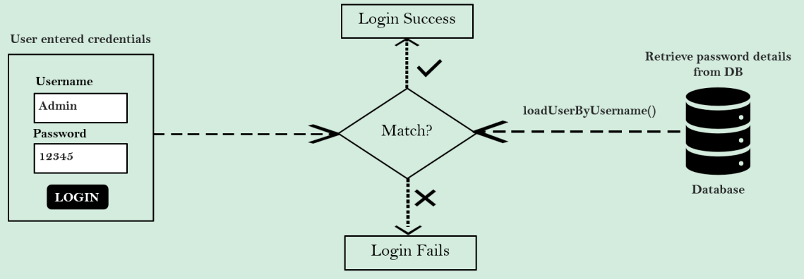
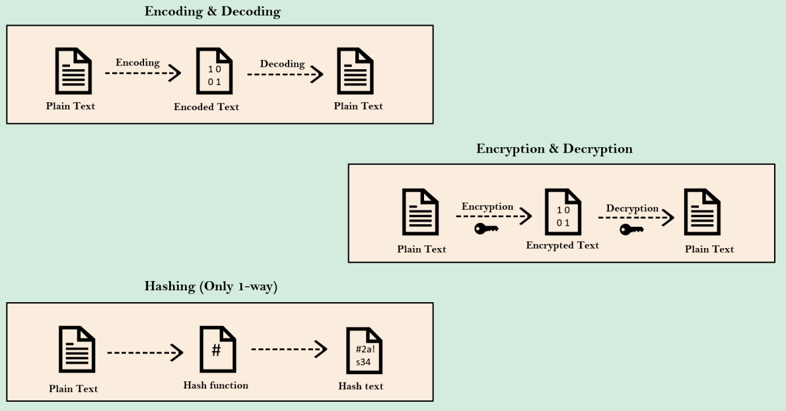
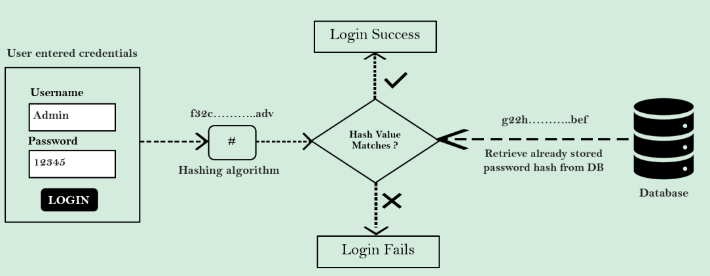

### Como a senha é validada (com `PasswordEncoder` padrão)

> Não é recomenado utilizar em produção



Armazenar senhas em texto puro dentro de um sistema de armazenamento como um banco de dados trará problemas de
integridade e confidencialidade. Portanto, essa não é uma abordagem recomendada para aplicativos de produção.

### Encoding vs Encryption vs Hashing

Diferentes formas de Gerenciamento de Senhas

* **Encoding (Codificação)**
    * Codificação é definida como o processo de converter dados de uma forma para outra e não tem nada a ver com
      criptografia.
    * Não envolve segredo algum e é completamente reversível.
    * A codificação não pode ser usada para proteger dados. Abaixo estão os vários algoritmos disponíveis publicamente
      usados para codificação.
    * Ex.: ASCII, Base64, Unicode

* **Encryption (Criptografia)**
    * Criptografia é definida como o processo de transformar dados de forma a garantir a confidencialidade.
    * Para alcançar a confidencialidade, a criptografia requer o uso de um segredo que, em termos criptográficos,
      chamamos de "key" (chave).
      *A criptografia pode ser reversível usando a descriptografia com a ajuda da "key". Desde que a "key" seja
      confidencial, a criptografia pode ser considerada segura.

* **Hashing**
    * No hashing, os dados são convertidos em um valor hash usando alguma função de hashing.
    * Os dados, uma vez obtidos em hash, não são reversíveis. Não é possível determinar os dados originais a partir de
      um valor hash gerado.
    * Dados arbitrários junto com a saída de um algoritmo de hashing, pode-se verificar se esses dados correspondem aos
      dados originais de entrada sem a necessidade de ver os dados originais.



### Como a senha é validada (com `Hashing` e `PasswordEncoder`)

Armazenar e gerenciar senhas com hashing é a abordagem recomendada para aplicativos de produção. Com
vários `PasswordEncoders` disponíveis dentro do Spring Security, nossa vida fica mais fácil.



### Details of `PasswordEncoder`

Interface de serviço para codificação de senhas.

```java
public interface PasswordEncoder {

	String encode(CharSequence rawPassword);

	boolean matches(CharSequence rawPassword, String encodedPassword);

	default boolean upgradeEncoding(String encodedPassword) {
		return false;
	}

}
```

* Diferentes implementações de `PasswordEncoder` no Spring Security
    * `NoOpPasswordEncoder` (Não recomendado para ambientes de produção): Esta implementação não codifica a senha. É
      útil apenas para fins de desenvolvimento e não deve ser usada em produção.
    * `StandardPasswordEncoder` (Não recomendado para ambientes de produção): Esta implementação usa o algoritmo MD5
      para codificar senhas. O MD5 é considerado inseguro devido à sua baixa complexidade e vulnerabilidade a colisões.
      Não é recomendado para ambientes de produção.
    * `Pbkdf2PasswordEncoder`: Esta implementação usa o algoritmo PBKDF2 (Password-Based Key Derivation Function 2). É
      uma opção mais segura que o MD5, pois permite configurar parâmetros como iterações e tamanho do hash para aumentar
      a complexidade do cálculo.
    * `BCryptPasswordEncoder`: Esta é uma implementação popular e recomendada para a maioria dos casos. O BCrypt é um
      algoritmo projetado especificamente para codificação de senhas e oferece um bom equilíbrio entre segurança e
      performance.
    * `SCryptPasswordEncoder`: O SCrypt é outro algoritmo seguro para codificação de senhas, similar ao BCrypt. Ele é
      considerado um pouco mais lento, mas pode ser uma opção se a performance não for uma preocupação crítica.
    * `Argon2PasswordEncoder`: O Argon2 é um algoritmo vencedor de uma competição de codificação de senhas e é
      considerado o mais seguro entre as opções apresentadas. No entanto, ele é o mais lento para processar.

---

Links:

* [Base64 Encode](https://www.base64encode.org/)
* [BCrypt Generator](https://bcrypt-generator.com/)