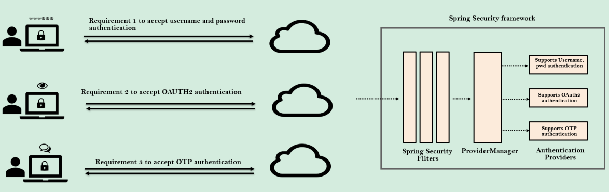
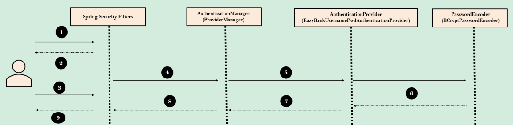
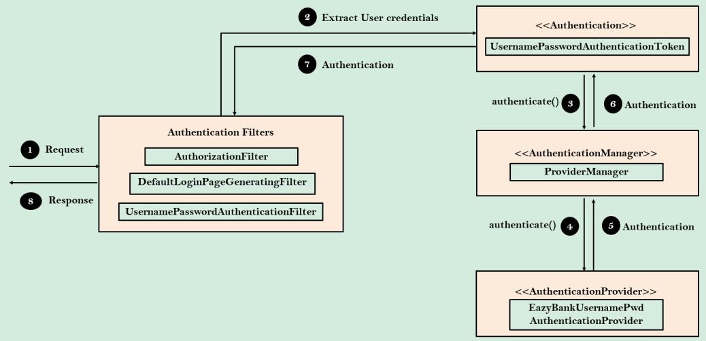

### Authentication Provider (Provedor de Autenticação)



* **Por que precisamos disso?**
    * Requisito 1: Aceitar autenticação por nome de usuário e senha.
    * Requisito 2: Aceitar autenticação OAUTH2.
    * Requisito 3: Aceitar autenticação por OTP (senha única).

O `AuthenticationProvider` no Spring Security cuida da lógica de autenticação. A implementação padrão
do `AuthenticationProvider` delega a responsabilidade de encontrar o usuário no sistema para a
implementação `UserDetailsService` e o `PasswordEncoder` para validação de senha. Mas se temos um requisito de
autenticação personalizado que não é atendido pela estrutura do Spring Security, podemos construir nossa própria lógica
de autenticação implementando a interface `AuthenticationProvider`.

É responsabilidade do `ProviderManager`, que é uma implementação do `AuthenticationManager`, verificar todas as
implementações de `AuthenticationProviders` e tentar autenticar o usuário.

### Detalhes do Authentication Provider

* Métodos dentro da interface `AuthenticationProvider`

```java
import org.springframework.security.core.Authentication;
import org.springframework.security.core.AuthenticationException;

public interface AuthenticationProvider {

	Authentication authenticate(Authentication authentication)
			throws AuthenticationException;

	boolean supports(Class<?> authentication);

}
```

O método `authenticate()` recebe e retorna um objeto de autenticação. Podemos implementar toda a nossa lógica de
autenticação personalizada dentro do método `authenticate()`.

O segundo método na interface `AuthenticationProvider` é `supports (Class <?> authentication)`. Você implementará este
método para retornar true se o `AuthenticationProvider` atual suportar o tipo do objeto `Authentication` fornecido.

Ao utilizar a classe `PetshopAuthenticationProvider`, deixamos de usar a `PetshopUserDetailsService`

### Fluxo de Sequência com nossa própria implementação de `AuthenticationProvider`



1. Usuário tenta acessar pela primeira vez uma página segura.
2. Nos bastidores, alguns filtros como `AuthorizationFilter` e `DefaultLoginPageGeneratingFilter` identificam que o
   usuário não está logado e o redirecionam para a página de login.
3. O usuário insere suas credenciais e a requisição é interceptada pelos filtros.
4. Filtros como `UsernamePasswordAuthenticationFilter` extraem o nome de usuário e a senha da requisição e criam um
   objeto `UsernamePasswordAuthenticationToken`, que é uma implementação da interface `Authentication`. Com o objeto
   criado, ele invoca o método `authenticate()` do `ProviderManager`.
5. O `ProviderManager`, que é uma implementação de `AuthenticationMananger`, identifica a lista
   de `AuthenticationProviders` disponíveis que suportam o estilo do objeto de autenticação fornecido. Neste cenário, o
   método `authenticate()` do nosso `AuthenticationProvider` personalizado será invocado pelo `ProviderManager`
6. O `PetshopAuthenticationProvider` carrega os detalhes do usuário do banco de dados. Uma vez que os detalhes do
   usuário são carregados, ele utiliza o `BCryptPasswordEncoder` configurado para comparar a senha e validar se o
   usuário é autêntico ou não.
7. Por fim, ele retorna o objeto `Authentication` com os detalhes de sucesso ou falha da autenticação para
   o `ProviderManager`.
8. O `ProviderManager` verifica se a autenticação foi bem-sucedida ou não. Se não, ele tentará com
   outros `AuthenticationProvider` disponíveis. Caso contrário, ele simplesmente retorna os detalhes de autenticação
   para os filtros.
9. O objeto `Authentication` é armazenado no objeto `SecurityContext` pelo filtro para uso futuro e a resposta é
   retornada ao usuário final.


