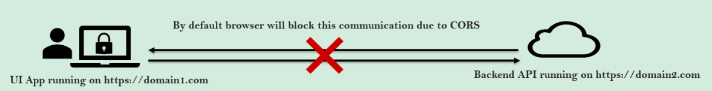

## Entendendo CORs & CSRF

* CORS: Cross-Origin Resource Sharing
* CSRF: Cross-Site Request Forgery
* Spring Security: How to handle them using the spring security framework?

### Cross-Origin Resource Sharing (CORS)

Compartilhamento de Recursos entre Origens (CORS)

CORS é um protocolo que permite que scripts executados em um navegador cliente interajam com recursos de uma origem
diferente. Por exemplo, se um aplicativo de interface do usuário deseja fazer uma chamada de API em execução em um
domínio diferente, ele seria bloqueado por padrão devido ao CORS. É uma especificação do W3C implementada pela maioria
dos navegadores.

Portanto, CORS não é um problema/ataque de segurança, mas a proteção padrão fornecida pelos navegadores para impedir o
compartilhamento de dados/comunicação entre diferentes origens.

"Origens diferentes" significa que o URL acessado difere do local de execução do JavaScript, por ter:

* um esquema diferente (HTTP or HTTPS)
* um domínio diferente
* uma porta diferente

Por padrão, o navegador bloqueará essa comunicação devido ao CORS.

* Aplicativo de interface do usuário em execução em https://domain1.com
* API de back-end em execução em https://domain2.com



### Solução para lidar com CORS

Se temos um cenário válido, onde uma interface do usuário de um aplicativo web implantada em um servidor está tentando
se comunicar com um serviço REST implantado em outro servidor, podemos permitir esse tipo de comunicação com a ajuda da
anotação `@CrossOrigin`. `@CrossOrigin` permite que clientes de qualquer domínio consumam a API.

A anotação `@CrossOrigin` pode ser mencionada no topo de uma classe ou método, como mencionado abaixo:

* `@CrossOrigin(origins = "http://localhost:4200")` // Permitirá no domínio especificado
* `@CrossOrigin(origins = "*")` // Permitirá em qualquer domínio

* **Depois que o CORS é habilitado no back-end:**
    * Aplicativo de interface do usuário em execução em https://domain1.com
    * API de back-end em execução em https://domain2.com


Em vez de mencionar a anotação `@CrossOrigin` em todos os controladores dentro do nosso aplicativo web, podemos definir
configurações relacionadas ao CORS globalmente usando o Spring Security, conforme mostrado abaixo:

```java

@Configuration
@EnableWebSecurity
public class SecurityConfig {

	@Bean
	public SecurityFilterChain defaultSecurityFilterChain(HttpSecurity http) throws Exception {

		http
				.csrf(AbstractHttpConfigurer::disable)
				.cors(cors -> cors.configurationSource(request -> {
					var config = new CorsConfiguration();
					config.setAllowedOrigins(Collections.singletonList("http://localhost:4200"));
					config.setAllowedMethods(Collections.singletonList("*"));
					config.setAllowCredentials(true);
					config.setAllowedHeaders(Collections.singletonList("*"));
					config.setMaxAge(3600L);
					return config;
				}))
				.authorizeHttpRequests((requests) -> requests
						.requestMatchers("/users/**", "/services/**").authenticated()
						.requestMatchers("/api/petshop/**", "/customers/register").permitAll())
				.formLogin(AbstractAuthenticationFilterConfigurer::permitAll)
				.sessionManagement(Customizer.withDefaults())
				.httpBasic(Customizer.withDefaults());
		return http.build();
	}

}    
```

### Cross-Site Request Forgery - CSRF

Uma falsificação de solicitação entre sites (Cross-Site Request Forgery - CSRF ou XSRF) é um ataque típico que visa
realizar uma operação em um aplicativo web em nome de um usuário, sem o consentimento explícito dele. No geral, ele não
rouba diretamente a identidade do usuário, mas o explora para realizar uma ação sem a sua vontade.

Imagine que você esteja usando o site netflix.com e o site do atacante seja evil.com.

**Passo 1**: O usuário do Netflix faz login no Netflix.com e o servidor backend do Netflix fornecerá um cookie que será
armazenado no navegador com o domínio Netflix.com


**Passo 2**: O mesmo usuário do Netflix abre o site evil.com em outra aba do navegador.


**Passo 3**: O usuário, tentado, clica no link malicioso que faz uma solicitação para o Netflix.com. E como o login já
está presente no mesmo navegador e a solicitação para alterar o e-mail está sendo feita para o mesmo domínio
Netflix.com, o servidor backend do Netflix.com não consegue diferenciar de onde a solicitação veio. Então, neste caso, o
evil.com falsificou a solicitação como se estivesse vindo de uma página da interface do usuário do Netflix.com.


### Solution to CSRF Attack

Para derrotar um ataque CSRF, os aplicativos precisam de uma maneira de determinar se a solicitação HTTP é gerada
legitimamente por meio da interface do usuário do aplicativo. A melhor maneira de conseguir isso é através de um token
CSRF. Um token CSRF é um token aleatório seguro usado para evitar ataques CSRF. O token precisa ser único por sessão do
usuário e deve ser um valor aleatório grande para dificultar a adivinhação.

Vamos ver como isso resolve o ataque CSRF usando o exemplo anterior do Netflix novamente:

**Passo 1**: O usuário do Netflix faz login no Netflix.com e o servidor backend do Netflix fornecerá um cookie que será
armazenado no navegador com o domínio Netflix.com, juntamente com um token CSRF único gerado aleatoriamente para esta
sessão de usuário específica. O token CSRF é inserido dentro de parâmetros ocultos dos formulários HTML para evitar a
exposição a cookies de sessão.


**Passo 2**: O mesmo usuário do Netflix abre o site evil.com em outra aba do navegador.


**Passo 3**: O usuário, tentado, clica no link malicioso que faz uma solicitação para o Netflix.com. E como o cookie de
login já está presente no mesmo navegador e a solicitação para alterar o e-mail está sendo feita para o mesmo domínio
Netflix.com. Desta vez, o servidor backend do Netflix.com espera o token CSRF junto com o cookie. O token CSRF deve ser
igual ao valor inicial gerado durante a operação de login.


O token CSRF será usado pelo servidor do aplicativo para verificar a legitimidade da solicitação do usuário final, se
ela está vindo da mesma interface do usuário do aplicativo ou não. O servidor do aplicativo rejeita a solicitação se o
token CSRF falhar ao corresponder ao teste.

### Desabilitar a proteção CSRF dentro do Spring Security

Por padrão, o Spring Security bloqueia todas as operações HTTP POST, PUT, DELETE e PATCH com um erro de 403, se não
houver uma solução CSRF implementada dentro de um aplicativo web. Podemos alterar esse comportamento padrão
desabilitando a proteção CSRF fornecida pelo Spring Security.

```java

@Configuration
@EnableWebSecurity
public class SecurityConfig {

	@Bean
	public SecurityFilterChain defaultSecurityFilterChain(HttpSecurity http) throws Exception {

		http
				.csrf(AbstractHttpConfigurer::disable) // CSRF - Não recomendado em produção
				.cors(cors -> cors.configurationSource(request -> {
					var config = new CorsConfiguration();
					config.setAllowedOrigins(Collections.singletonList("*"));
					config.setAllowedMethods(Collections.singletonList("*"));
					config.setAllowCredentials(true);
					config.setAllowedHeaders(Collections.singletonList("*"));
					config.setMaxAge(3600L);
					return config;
				}))
				.authorizeHttpRequests((requests) -> requests
						.requestMatchers("/users/**", "/services/**").authenticated()
						.requestMatchers("/api/petshop/**", "/customers/register").permitAll())
				.formLogin(AbstractAuthenticationFilterConfigurer::permitAll)
				.sessionManagement(Customizer.withDefaults())
				.httpBasic(Customizer.withDefaults());
		return http.build();
	}
}
```

### Solução de ataque CSRF dentro do Spring Security

Com a configuração fornecida do Spring Security, podemos permitir que o framework gere um token CSRF aleatório que pode
ser enviado para a interface do usuário após o login bem-sucedido. O mesmo token precisa ser enviado pela interface do
usuário para todas as solicitações subsequentes que ele está fazendo para o backend. Para determinados caminhos, podemos
desabilitar o CSRF com a ajuda de `ignoringRequestMatcher`.

```java
public class SecurityConfig {

	/**
	 * Configurações personalizadas de segurança para proteger o sistema contra acesso não autorizado, uso indevido e
	 * outras ameaças.
	 */
	@Bean
	public SecurityFilterChain defaultSecurityFilterChain(HttpSecurity http) throws Exception {

		var requestHandler = new CsrfTokenRequestAttributeHandler();
		requestHandler.setCsrfRequestAttributeName("_csrf");

		http
				.securityContext((context) -> context.requireExplicitSave(false))
				.sessionManagement((session) -> session.sessionCreationPolicy(SessionCreationPolicy.STATELESS))
				// Cross-Origin Resource Sharing
				.cors((cors) -> cors.configurationSource(request -> {
					var config = new CorsConfiguration();
					config.setAllowedOrigins(Collections.singletonList("http://localhost:4200"));
					config.setAllowedMethods(Collections.singletonList("*"));
					config.setAllowCredentials(true);
					config.setAllowedHeaders(Collections.singletonList("*"));
					config.setMaxAge(3600L);
					return config;
				}))
				// Cross-Site Request Forgery
				.csrf((csrf) -> csrf.csrfTokenRequestHandler(requestHandler)
						.ignoringRequestMatchers("/api/petshop/**", "/register")
						.csrfTokenRepository(CookieCsrfTokenRepository.withHttpOnlyFalse()))
				.addFilterAfter(new CsrfCookieFilter(), BasicAuthenticationFilter.class)
				.authorizeHttpRequests((requests) -> requests
						.requestMatchers("/users/**", "/services/**", "/customers").authenticated()
						.requestMatchers("/api/petshop/**", "/register").permitAll())
				.formLogin(Customizer.withDefaults())
				.httpBasic(Customizer.withDefaults());
		return http.build();
	}
}
```

---

## Resumo sobre CSRF e CORS

### CSRF (Cross-Site Request Forgery)

* **O que é?** Um ataque que explora um usuário logado para realizar ações indesejadas em um aplicativo web.
* **Como funciona?** Um site malicioso induz o usuário a clicar em um link ou carregar um script que faz uma solicitação
  em nome do usuário para outro site que ele está autenticado.
* **Exemplo**: Um site malicioso envia um e-mail para um usuário do banco com um link que, quando clicado, faz uma
  solicitação para o site do banco para transferir dinheiro da conta do usuário para o atacante.
* **Como se proteger?**
    * Usar tokens CSRF para verificar a origem da solicitação.
    * Implementar medidas de segurança no lado do servidor, como validação de entrada e saída.
    * Educar os usuários sobre os riscos de CSRF.

### CORS (Cross-Origin Resource Sharing)

* **O que é?** Um mecanismo que permite que recursos de um site sejam acessados por outro site em um domínio diferente.
* **Como funciona?** O navegador do usuário envia uma solicitação CORS para o servidor do outro site, que verifica se a
  solicitação é permitida.
* **Exemplo**: Um site de notícias carrega imagens de um site de fotos.
* **Como se proteger?**
    * Configurar o CORS corretamente no servidor para permitir apenas solicitações de sites confiáveis.
    * Usar tokens de autenticação para verificar a identidade do usuário.

Por fim, podemos dizer que:

* CSRF explora a confiança do navegador em sites autenticados, enquanto CORS permite o compartilhamento seguro de
  recursos entre sites diferentes.
* Ambos são importantes para a segurança web, mas exigem configurações e medidas de proteção específicas para serem
  eficazes.