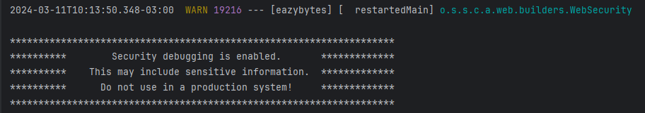
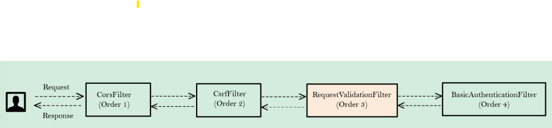
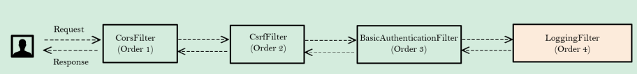
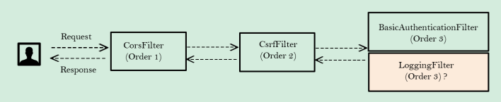

# Escrevendo nossos próprios filtros personalizados no Spring Security

## Filtros no Spring Security

Muitas vezes, teremos situações em que precisamos realizar algumas atividades de manutenção durante o fluxo de
autorização. Alguns exemplos são:

* Validação de entrada
* Rastreamento, auditoria e relatórios
* Registro de entrada como endereço IP etc.
* Criptografia e Descriptografia
* Autenticação multifator usando OTP

Todos esses requisitos podem ser tratados usando Filtros HTTP dentro do Spring Security. Os filtros também são
aproveitados pelo servlet no Spring Security.

Já vimos alguns filtros internos do Spring Security Framework
como `UsernamePasswordAuthenticationFilter`, `BasicAuhtenticationFilter`, `DefaultLoginPageGeneratingFilter` etc. nas
seções anteriores.

Um filtro é um componente que recebe solicitações, processa sua lógica e as transfere para a cadeia.

O Spring Security é baseado em uma cadeia de filtros de servlet. Cada filtro possui uma responsabilidade e configuração
específicas, podendo ser adicionados ou removidos. Também podemos adicionar nossos filtros personalizados conforme a
necessidade.

> Não recomendado para produção

Podemos sempre verificar os filtros registrados dentro do Spring Security com as configurações abaixo:

1. `@EnableWebSecurity(debug = ture)`: É necessário habilitar a depuração dos detalhes de segurança.
2. Habilite o registro dos detalhes adicionando a propriedade abaixo em application.properties (ou yaml):

```yaml
logging:
  level:
    org.springframework.security.web.FilterChainProxy: DEBUG
```

Retorno no console quando ativado o debug:



Em anexo estão alguns dos filtros internos do Spring Security que são executados no fluxo de autenticação.

### Implementando filtros personalizados dentro do Spring Security

Podemos criar nossos próprios filtros implementando a interface `Filter` do pacote `jakarta.servlet`. Posteriormente,
precisamos sobrescrever o método `doFilter()` para ter nossa própria lógica personalizada. Este método aceita 3
parâmetros: `ServletRequest`, `ServletResponse` e `FilterChain`.

* `ServletRequest`: representa a solicitação HTTP. Usamos o objeto `ServletRequest` para recuperar detalhes sobre a
  solicitação do cliente.
* `ServletResponse`: representa a resposta HTTP. Usamos o objeto `ServletResponse` para modificar a resposta antes de
  enviá-la de volta ao cliente ou para o restante da cadeia de filtros.
* `FilterChain`: a cadeia de filtros representa uma coleção de filtros com uma ordem definida na qual eles atuam. Usamos
  o objeto `FilterChain` para encaminhar a solicitação para o próximo filtro na cadeia.

Você pode adicionar um novo filtro à cadeia do Spring Security antes, depois ou na posição de um conhecido. Cada posição
do filtro é um índice (um número) e também pode ser chamada de "the order".

Abaixo estão os métodos disponíveis para configurar um filtro personalizado no fluxo do Spring Security:

* `addFilterBefore(filter, class)`: adiciona um filtro antes da posição da classe de filtro especificada.
* `addFilterAfter(filter, class)`: adiciona um filtro após a posição da classe de filtro especificada.
* `addFilterAt(filter, class)`: adiciona um filtro no local da classe de filtro especificada.

## Adicionando Filtros no Srping Security

### Add Filter Before

`addFilterBefore(filter, class)`: adiciona um filtro **antes** da posição da classe de filtro especificada.



Aqui, adicionamos um filtro **antes** da autenticação para implementar nossa própria validação personalizada, onde o
email fornecido não deve conter a string 'teste'.

### Add Filter After

`addFilterAfter(filter, class)`: adiciona um filtro **após** a posição da classe de filtro especificada.



Aqui, adicionamos um filtro logo **após** a autenticação para registrar em log detalhes de autenticação bem-sucedida e
informações de autoridade dos usuários logados.

### Add Filter At

`addFilterAt(filter, class)`: adiciona um filtro na **localização** da classe de filtro especificada. Porém, a ordem de
execução não é garantida. Isso não substituirá os filtros já presentes na mesma ordem.



Como não teremos controle sobre a ordem dos filtros e ela é aleatória por natureza, devemos evitar fornecer filtros na
mesma ordem.

## Outros Filtros Importantes

* `GenericFilterBean`: Esta é uma classe abstrata de filtro que permite usar os parâmetros de inicialização e
  configurações definidas dentro dos descritores de implementação.
* `OncePerRequestFilter`: O Spring Security não garante que seu filtro seja chamado apenas uma vez por requisição. Mas
  se temos um cenário onde precisamos ter certeza de executar nosso filtro apenas uma vez, podemos usar este.

