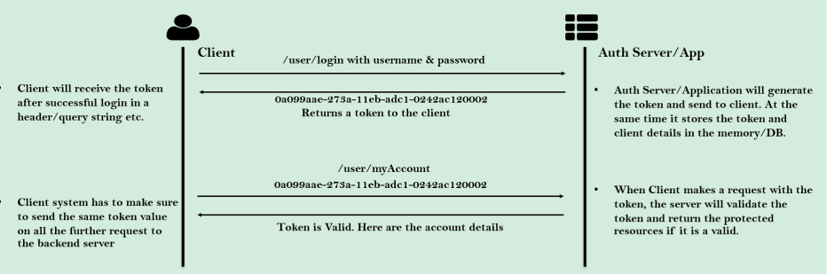
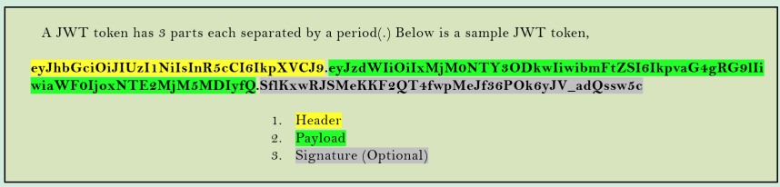
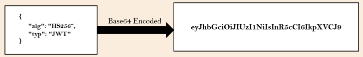
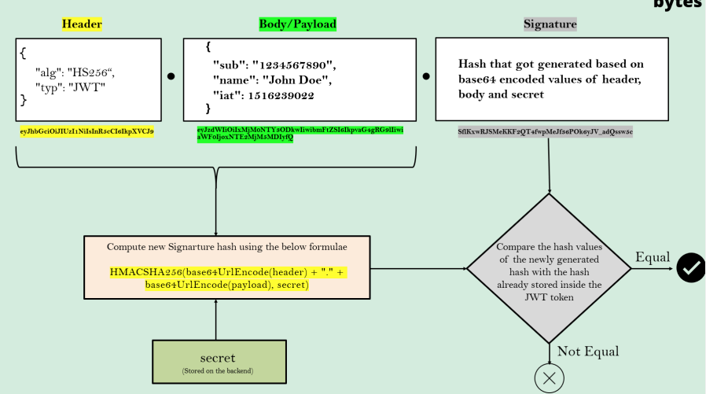
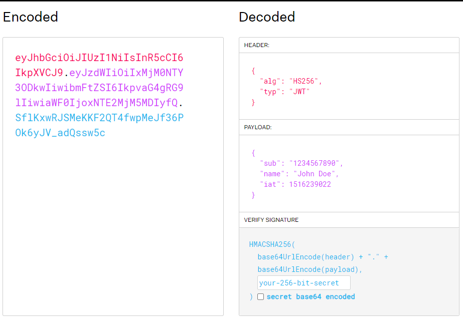

# Token based Authentication using JSON Web Token (JWT)

## Papel (role) dos Tokens em AuthN e AuthZ (Autenticação e Autorização)

Um token pode ser uma string simples no formato de identificador universalmente único (UUID) ou do tipo JSON Web Token (
JWT), geralmente gerado quando o usuário é autenticado pela primeira vez durante o login.

Em cada solicitação a um recurso restrito, o cliente envia o token de acesso na string de consulta (query string) ou no
cabeçalho de autorização. O servidor então valida o token e, se for válido, retorna o recurso seguro ao cliente.



* O cliente receberá o token após o login bem-sucedido em um cabeçalho/string de consulta, etc.
* **Client** > `/user/login` com nome de usuário e senha
* **Auth Server/App** > Retorna um token para o cliente
* O servidor de autenticação/aplicativo gera o token e o envia ao cliente. Ao mesmo tempo, ele armazena o token e os
  detalhes do cliente na memória/banco de dados.
* O sistema do cliente deve garantir o envio do mesmo valor de token em todas as solicitações posteriores ao servidor
  back-end.
* **Client** > `/user/myAccount` + token
* **Auth Server/App** > Token válido. Aqui estão os detalhes da conta.
* Quando o cliente faz uma solicitação com o token, o servidor valida o token e retorna os recursos protegidos se ele
  for válido.

## Vantagens do Tokens

* Os tokens nos ajudam a não compartilhar credenciais a cada requisição. É um risco de segurança enviar credenciais pela
  rede com frequência.
* Os tokens podem ser invalidados durante qualquer atividade suspeita, sem invalidar as credenciais do usuário.
* Os tokens podem ser criados com um curto tempo de vida.
* **Reusabilidade**: podemos ter vários servidores separados, rodando em múltiplas plataformas e domínios, reutilizando
  o mesmo token para autenticar o usuário.
* **Statelss** (sem estado), mais fácil de escalar. O token contém todas as informações para identificar o usuário,
  eliminando a necessidade do estado da sessão. Se usarmos um balanceador de carga, podemos passar o usuário para
  qualquer servidor, em vez de ficarmos vinculados ao mesmo servidor em que fizemos o login.
* Já usamos tokens nas seções anteriores na forma de tokens CSRF e JSESSIONID.
    * CSRF: O token protege nossa aplicação de ataques CSRF.
    * JSESSIONID: é o token padrão gerado pelo Spring Security que nos ajudou a não compartilhar as credenciais com o
      back-end toda vez.

## JWT Tokens

* JWT significa JSON Web Token. É uma implementação de token que fica no formato JSON e foi projetada para uso em
  requisições web.
* JWT é o tipo de token mais comum e favorito usado por muitos sistemas atualmente devido às suas características e
  vantagens especiais.
* Os tokens JWT podem ser usados em cenários de autorização/autenticação junto com troca de informações, o que significa
  que você pode compartilhar determinados dados relacionados ao usuário no próprio token, o que reduzirá a carga de
  manter esses detalhes nas sessões do lado do servidor.



Um token JWT possui 3 partes, cada uma separada por um ponto (.). Abaixo está um exemplo de token JWT:

1. Header (cabeçalho)
2. Payload (carga)
3. Signature (assinatura - opcional)

```
eyJhbGciOiJIUzI1NiIsInR5cCI6IkpXVCJ9.
eyJzdWIiOiIxMjM0NTY3ODkwIiwibmFtZSI6IkpvaG4gRG9lIiwiaWF0IjoxNTE2MjM5MDIyfQ.
SflKxwRJSMeKKF2QT4fwpMeJf36POk6yJV_adQssw5c
```

* Header

Dentro do cabeçaho (header) JWT, armazenamos metadados/informações relacionadas ao token. Se eu optar por assinar o
token, o cabeçaho (header) conterá o nome do algoritmo que gera a assinatura.



* Body

No corpo (body), podemos armazenar detalhes relacionados ao usuário, funções etc., que podem ser usados posteriormente
para AuthN e AuthZ (Autenticação e Autorização). Embora não haja nenhuma limitação sobre o que podemos enviar e quanto
podemos enviar no corpo (body), devemos nos esforçar para mantê-lo o mais leve possível.


* Digital Signature (assinatura digital)

A última parte do token é a assinatura digital. Essa parte pode ser opcional se a parte com quem você compartilha o
token JWT for interna e confiável, mas não pública na web.

Porém, se você estiver compartilhando esse token com aplicativos clientes que serão usados por todos os usuários na web
aberta, então precisamos garantir que ninguém altere os valores do cabeçalho e do corpo, como autoridades, nome de
usuário etc.

Para garantir que ninguém adulterou os dados na rede, podemos enviar a assinatura do conteúdo quando o token for gerado
inicialmente. Para criar a parte da assinatura, você deve pegar o cabeçalho codificado, a carga codificada, um segredo,
o algoritmo especificado no cabeçalho e assiná-los.

Por exemplo, se você quiser usar o algoritmo HMAC SHA256, a assinatura será criada da seguinte maneira:

`HMAC SHA256(base64UrlEncode(header) + "." + base64UrlEncode(payload), secret)`

A assinatura é usada para verificar se a mensagem não foi alterada ao longo do caminho e, no caso de tokens assinados
com uma chave privada, também pode verificar se o remetente do JWT é quem ele diz ser.

### Validação de Tokens JWT



Se você quiser brincar com tokens JWT e colocar esses conceitos em prática, você pode usar o decodificador jwt.io para
decodificar, verificar e gerar JWTs.



## Referências

- [jwt.io](https://jwt.io/)