# Deep dive of OAuth2 & OpenID Connect

## OAuth2

## Introdução ao OAuth2 - Problema resolvido pelo OAuth2

- **Twitter App** (aplicativo twitter)
- **Twitter user** (usuário do twitter)
- Site **TweetAnalyzer** que analisa dados de tweets do usuário e gera métricas a partir deles.

**Cenário**: O usuário do Twitter deseja usar um site de terceiros chamado **TweetAnalyzer** para obter _insights_ sobre
seus dados de tweets presentes no aplicativo do Twitter.

* **Sem OAuth2**: O usuário do Twitter precisa compartilhar suas credenciais da conta do Twitter com o site
  TweetAnalyzer. Usando as credenciais do usuário, o site TweetAnalyzer invocará as APIs do aplicativo do Twitter para
  buscar os detalhes do tweet e postar, o que gera um relatório para o usuário final.

Mas isso tem uma grande desvantagem: o TweetAnalyzer pode se tornar fraudulento e realizar outra operação em seu nome,
como alterar senha, alterar e-mail, fazer um tweet malicioso etc.

* **Com OAuth2**: O usuário do Twitter não precisa compartilhar suas credenciais da conta do Twitter com o site
  TweetAnalyzer. Em vez disso, ele permitirá que o aplicativo do Twitter forneça um token de acesso temporário ao
  TweetAnalyzer com acesso limitado, como a capacidade de ler apenas os dados dos tweets.

Com essa abordagem, o TweetAnalyzer só pode ler os dados dos tweets e não pode realizar nenhuma outra operação.

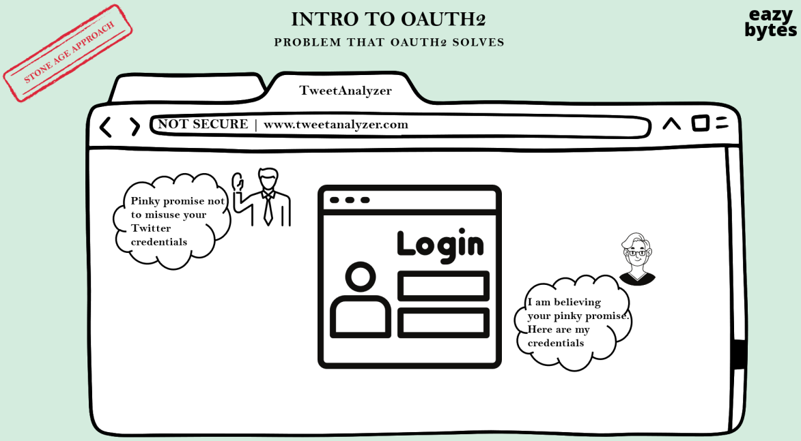

> Abordagem da idade da pedra

A: Prometo solenemente não abusar de suas credenciais do Twitter.
B: Estou acreditando na sua promessa. Aqui estão minhas credenciais.

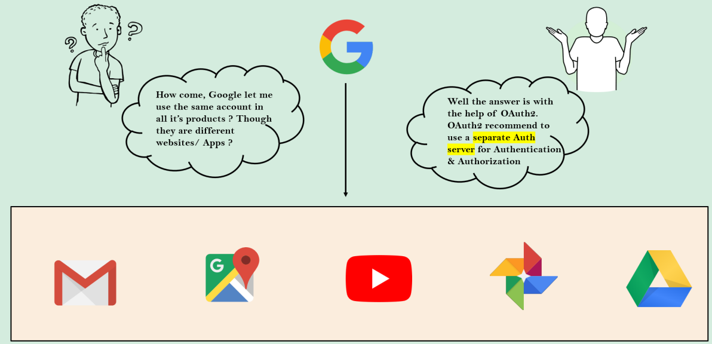

A: Como assim, o Google me permite usar a mesma conta em todos os seus produtos? Embora sejam sites/aplicativos
diferentes?
B: Bem, a resposta está na ajuda do OAuth2. O OAuth2 recomenda o uso de um servidor de autenticação separado para
autenticação e autorização.

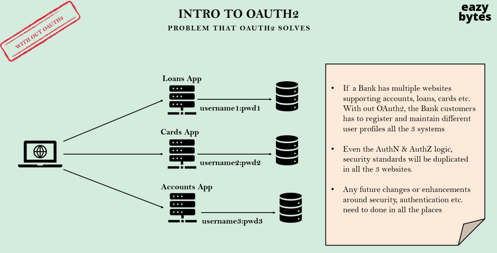

> Sem OAuth2

* Se um banco possui vários sites que oferecem suporte a contas, empréstimos, cartões etc. Sem o OAuth2, os clientes do
  banco precisam se registrar e manter diferentes perfis de usuário em todos os três sistemas.
* Mesmo a lógica de AuthN e AuthZ, os padrões de segurança serão duplicados em todos os três sites.
* Quaisquer alterações ou melhorias futuras em torno de segurança, autenticação etc. precisam ser feitas em todos os
  lugares.

OAuth significa Autorização Aberta. É um protocolo gratuito e aberto, construído em padrões IETF e licenças da Open Web
Foundation.

OAuth 2.0 é um padrão de segurança onde você concede a um aplicativo permissão para acessar seus dados em outro
aplicativo. As etapas para conceder permissão, ou consentimento, geralmente são chamadas de autorização ou até mesmo
autorização delegada. Você autoriza um aplicativo a acessar seus dados ou usar recursos em outro aplicativo em seu nome,
sem fornecer sua senha.

De várias maneiras, você pode pensar no token OAuth como um "cartão de acesso" em qualquer escritório/hotel. Esses
tokens fornecem acesso limitado a alguém, sem entregar o controle total na forma da chave mestra.

A estrutura OAuth especifica vários tipos de concessão para diferentes casos de uso, bem como uma estrutura para a
criação de novos tipos de concessão.

* Authorization Code (Código de autorização)
* PKCE
* Client Credentials (Credenciais do Cliente)
* Device Code (Código do dispositivo)
* Refresh Token (Token de atualização)
* Implicit Flow (Legacy) - Fluxo implícito (legado)
* Password Grant (Legacy) - Grant de senha (legado)

### Terminologia OAuth2

**Resource owner** (propriedade de recurso): É o usuário final. No cenário do TweetAnalyzer, o usuário final que deseja
usar o site TweetAnalyzer para obter insights sobre seus tweets. Em outras palavras, o usuário final possui os
recursos (Tweets), por isso o chamamos de proprietário do recurso.

**Client** (cliente): O site TweetAnalyzer é o cliente aqui, pois é ele que interage com o Twitter após obter permissão
do proprietário do recurso/usuário final.

**Authorization Server** (servidor de autorização): É o servidor que conhece o proprietário do recurso. Em outras
palavras, o proprietário do recurso deve ter uma conta neste servidor. No cenário do TweetAnalyzer, o servidor do
Twitter que possui a lógica de autorização funciona como servidor de autorização.

**Resource Server** (servidor de recurso): É o servidor onde as APIs, serviços que o cliente deseja consumir, estão
hospedados. No cenário do TweetAnalyzer, o servidor do Twitter que possui APIs como `/getTweets` etc. A lógica é
implementada. Em organizações menores, um único servidor pode atuar como servidor de recursos e servidor de
autenticação.

**Scopes**: São as permissões granulares que o Cliente deseja, como acesso a dados ou para realizar determinadas ações.
No cenário do TweetAnalyzer, o servidor de autorização pode emitir um token de acesso ao cliente com o escopo de apenas
READ TWEETS (LEITURA DE TWETTS).

### Fluxo de Amostra OAuth 2 no Cenário TwettAnalyzer

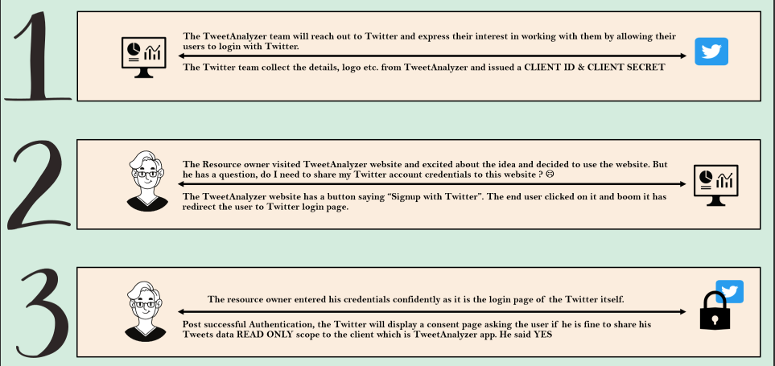

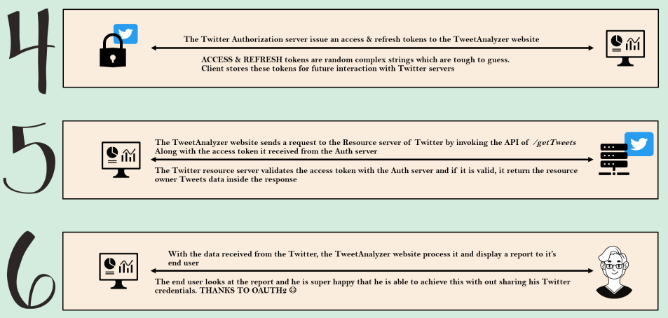

1. A equipe do TweetAnalyzer entrará em contato com o Twitter e expressará seu interesse em trabalhar com eles,
   permitindo que seus usuários façam login com o Twitter. O Twitter coletará os detalhes, logotipo etc. do
   TweetAnalyzer e emitirá um CLIENT ID e CLIENT SECRET.

2. O proprietário do recurso visitou o site do TwetAnalyzer e ficou animado com a ideia e decidiu usar o site. Mas ele
   tem uma pergunta: preciso compartilhar minhas credenciais da conta do Twitter com este site? O site do TweetAnalyzer
   possui um botão dizendo "Inscreva-se com o Twitter" ("Signup with Twitter"). O usuário final clicou nele e boom, ele
   redirecionou o usuário para a página de login do Twitter.

3. O proprietário do recurso inseriu suas credenciais com confiança, pois é a própria página de login do Twitter. Após a
   autenticação bem-sucedida, o Twitter exibirá uma página de consentimento perguntando ao usuário se ele concorda em
   compartilhar seus dados de Tweets com escopo READ ONLY (SOMENTE LEITURA) com o cliente, que é o aplicativo
   TweetAnalyzer. Ele disse SIM.

4. O servidor de autorização do Twitter emite tokens de acesso e atualização para o site do TweetAnalyzer. Os tokens de
   ACCESS e REFRESH (ACESSO e ATUALIZAÇÃO) são strings complexas aleatórias que são difíceis de adivinhar. O cliente
   armazena esses tokens para interação futura com os servidores do Twitter.

5. O site do TweetAnalyzer envia uma solicitação ao servidor de recursos do Twitter invocando a API de `/getTweets`.
   Junto com o token de acesso que recebeu do servidor de autorização. O servidor de recursos do Twitter valida o token
   de acesso com o servidor de autorização e, se for válido, retorna os dados dos Tweets do proprietário do recurso
   dentro da resposta.

6. Com os dados recebidos do Twitter, o site do TweetAnalyzer os processa e exibe um relatório para o usuário final. O
   usuário final olha o relatório e fica super feliz por poder fazer isso sem compartilhar suas credenciais do Twitter.
   GRAÇAS AO AUTH2.

### 1. OAuth2 flow in the Authorization Code grant type

(Fluxo OAuth2 no tipo de concessão de código de autorização)

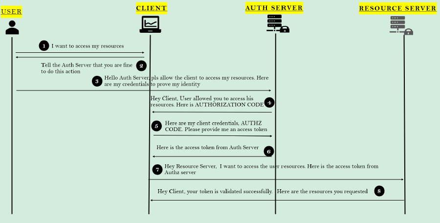

1. **Usuário (User)**: Eu quero acessar meus recursos
2. **Cliente (Client)**: Informe ao servidor de autorização que você concorda com esta ação
3. **Usuário (User)**: Olá servidor de autorização, por favor permita que o cliente acesse meus recursos. Aqui estão
   minhas credenciais para provar minha identidade.
4. **Servidor de Autorização (Auth Server)**: Olá Cliente, o Usuário permitiu que você acessasse seus recursos. Aqui
   está o CÓDIGO DE AUTORIZAÇÃO (AUTHORIZATION CODE).
5. **Cliente (Client)**: Aqui estão minhas credenciais de cliente, Código de Autorização. Por favor, me forneça um token
   de acesso.
6. **Servidor de Autorização (Auth Server)**: Aqui está o token de acesso do servidor de autorização.
7. **Cliente (Client)**: Olá servidor de recursos, quero acessar os recursos do usuário. Aqui está o token de acesso do
   servidor de autorização
8. **Servidor de Recursos (Resource Server)**: Olá Cliente, seu token foi validado com sucesso. Aqui estão os recursos
   solicitados.

Nas etapas 2 e 3, onde o cliente está fazendo uma solicitação ao endpoint do servidor de autorização, ele deve enviar os
seguintes detalhes importantes:

* **client_id**: o identificador do aplicativo cliente pelo servidor de autorização. Isso será concedido quando o
  cliente se registrar pela primeira vez no servidor de autorização.
* **redirect_uri**: o valor URI para o qual o servidor de autorização precisa redirecionar após a autenticação
  bem-sucedida. Se um valor padrão for fornecido durante o registro, esse valor é opcional.
* **scope**: semelhante a Authorities. Especifica o nível de acesso que o cliente está solicitando, como READ.
* **state**: Valor do token CSRF para proteção contra ataques CSRF.
* **response_type**: com o valor 'code' que indica que queremos seguir a concessão de código de autorização.

Na etapa 5, onde o cliente, após receber um código de autorização do servidor de autorização, fará novamente uma
solicitação ao servidor de autorização para um token com os seguintes valores:

* **code**: o código de autorização recebido das etapas anteriores
* **client_id** e client_secret: as credenciais do cliente que estão registradas no servidor de autorização. Observe que
  essas não são credenciais de usuário.
* **grant_type**: com o valor 'authorization_code' que identifica o tipo de concessão usada.
* **redirect_uri**

Podemos nos perguntar por que no tipo de concessão de código de autorização o cliente está fazendo solicitações 2 vezes
ao servidor de autorização para código de autorização e token de acesso.

* Na primeira etapa, o servidor de autorização garantirá que o usuário interagiu diretamente com ele junto com as
  credenciais. Se os detalhes estiverem corretos, o servidor de autorização enviará o código de autorização ao cliente.
* Assim que recebe o código de autorização, nesta etapa o cliente precisa provar sua identidade junto com o código de
  autorização e as credenciais do cliente para obter o token de acesso.

Você pode perguntar por que o servidor de autorização não pode simplesmente agrupar as duas etapas e fornecer o token em
uma única etapa. A resposta é que tínhamos esse tipo de concessão também, chamado de 'concessão implícita'. Mas esse
tipo de concessão não é recomendado devido à sua menor segurança.

### 2. OAuth2 flow in the Implicit grant flow (not recommended for production)

(Fluxo OAuth2 no tipo de concessão implícita - não recomendado para produção)

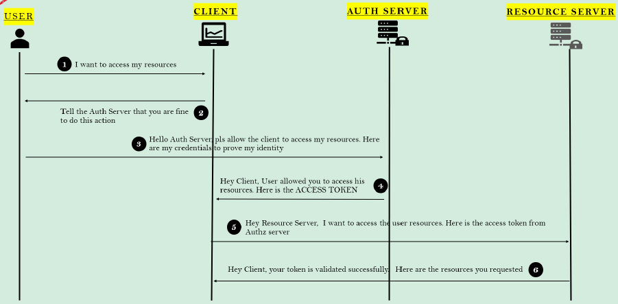

1. **Usuário (User)**: Eu quero acessar meus recursos
2. **Cliente (Client)**: Informe ao servidor de autorização que você concorda com esta ação
3. **Usuário (User)**: Olá servidor de autorização, por favor permita que o cliente acesse meus recursos. Aqui estão
   minhas credenciais para provar minha identidade.
4. **Servidor de Autorização (Auth Server)**: Olá Cliente, o Usuário permitiu que você acessasse seus recursos. Aqui
   está o TOKEN DE ACESSO (ACCESS TOKEN).
5. **Cliente (Client)**: Olá servidor de recursos, quero acessar os recursos do usuário. Aqui está o token de acesso do
   servidor de autorização.
6. **Servidor de Recursos (Resource Server)**: Olá Cliente, seu token foi validado com sucesso. Aqui estão os recursos
   solicitados.

Na etapa 5, onde o cliente está fazendo uma solicitação ao endpoint do servidor de autorização, ele deve enviar os
seguintes detalhes importantes:

* **client_id**: o identificador do aplicativo cliente pelo servidor de autorização. Isso será concedido quando o
  cliente se registrar pela primeira vez no servidor de autorização.
* **redirect_uri**: o valor URI para o qual o servidor de autorização precisa redirecionar após a autenticação
  bem-sucedida. Se um valor padrão for fornecido durante o registro, esse valor é opcional.
* **scope**: semelhante a Authorities. Especifica o nível de acesso que o cliente está solicitando, como READ.
* **state**: Valor do token CSRF para proteção contra ataques CSRF.
* **response_type**: com o valor 'token' que indica que queremos seguir o tipo de concessão implícita.

Se o usuário aprovar a solicitação, o servidor de autorização redirecionará o navegador de volta para o redirect_uri
especificado pelo aplicativo, adicionando um token e um estado à parte de fragmento da URL.

O fluxo de concessão implícita é obsoleto e não é recomendado para uso em aplicativos de produção. Sempre use o fluxo de
concessão de código de autorização em vez do fluxo de concessão implícita.

### 3. OAuth2 Flow in the Password Grant/Resource Owner Credentials Grant Type (not recommended for production)

(Fluxo OAuth2 no tipo de concessão de senha/credenciais do proprietário do recurso - não recomendado para produção)

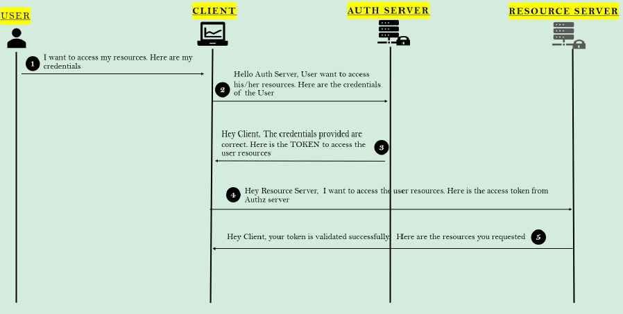

1. **Usuário (User)**: Eu quero acessar meus recursos. Aqui estão minhas credenciais.
2. **Cliente (Client)**: Olá servidor de autorização, o usuário deseja acessar seus recursos. Aqui estão as credenciais
   do usuário.
3. **Servidor de Autorização (Auth Server)**: Olá Cliente, as credenciais fornecidas estão corretas. Aqui está o TOKEN
   para acessar os recursos do usuário.
4. **Cliente (Client)**: Olá servidor de recursos, quero acessar os recursos do usuário. Aqui está o token de acesso do
   servidor de autorização.
5. **Servidor de Recursos (Resource Server)**: Olá Cliente, seu token foi validado com sucesso. Aqui estão os recursos
   solicitados.

Na etapa 2, onde o cliente está fazendo uma solicitação ao endpoint do servidor de autorização, ele deve enviar os
seguintes detalhes importantes:

* **client_id** e **client_secret**: as credenciais do cliente para se autenticar.
* **scope**:  semelhante a Authorities. Especifica o nível de acesso que o cliente está solicitando, como READ.
* **username** e **password**: credenciais fornecidas pelo usuário no fluxo de login.
* **grant_type**: om o valor 'password' que indica que queremos seguir o tipo de concessão de senha.

Usamos esse fluxo de autenticação somente se o cliente, o servidor de autorização e os servidores de recursos forem
mantidos pela mesma organização.

Esse fluxo normalmente será seguido pelos aplicativos corporativos que desejam separar o fluxo de autenticação e o fluxo
de negócios. Uma vez que o fluxo de autenticação é separado, diferentes aplicativos na mesma organização podem
aproveitá-lo.

### 4. OAuth2 Flow in the Client Credentials Grant Type

(Fluxo OAuth2 no Tipo de Concessão de Credenciais do Cliente)

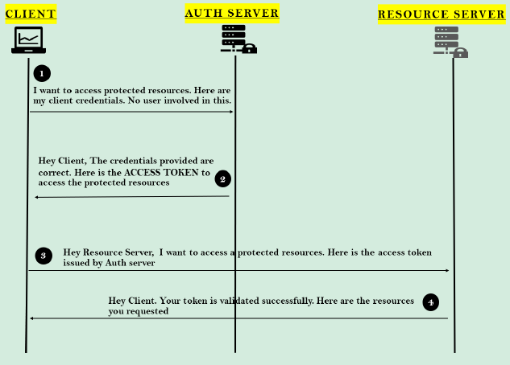

1. **Cliente (Client)**: Eu quero acessar recursos protegidos. Aqui estão minhas credenciais de cliente. Nenhum usuário
   está envolvido nisso.
2. **Servidor de Autorização (Auth Server)**: Olá Cliente, as credenciais fornecidas estão corretas. Aqui está o TOKEN
   DE ACESSO (ACCESS TOKEN) para acessar os recursos protegidos.
3. **Cliente (Client)**: Olá servidor de recursos, quero acessar um recurso protegido. Aqui está o token de acesso
   emitido pelo servidor de autorização.
4. **Servidor de Recursos (Resource Server)**: Olá Cliente, seu token foi validado com sucesso. Aqui estão os recursos
   solicitados.

Na etapa 1, onde o cliente está fazendo uma solicitação ao endpoint do servidor de autorização, ele deve enviar os
seguintes detalhes importantes:

* **client_id** e **client_secret**: as credenciais do cliente para se autenticar.
* **scope**: semelhante a Authorities. Especifica o nível de acesso que o cliente está solicitando, como READ.
* **grant_type**: com o valor 'client_credentials' que indica que queremos seguir o tipo de concessão de credenciais do
  cliente.

Este é o fluxo de concessão mais simples no OAuth2.

Usamos esse fluxo de autenticação somente se não houver usuário e interface do usuário envolvidos. Como nos cenários em
que 2 aplicativos diferentes desejam compartilhar dados entre si usando APIs de back-end.

### 5. OAuth2 Flow in the Refresh Token Grant Type

(Fluxo OAuth2 no Tipo de Concessão de Token de Atualização)

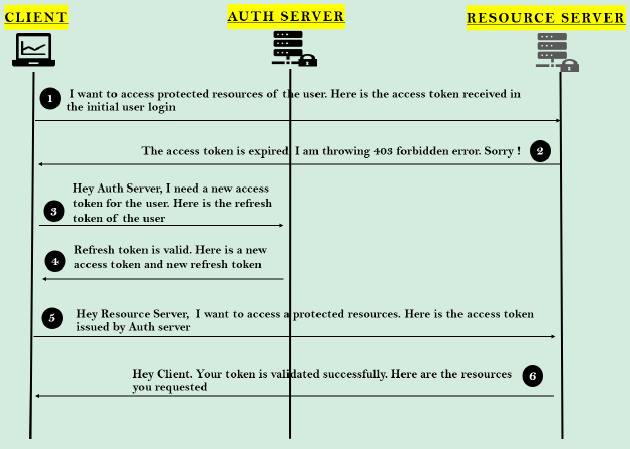

1. **Cliente (Client)**: Eu quero acessar recursos protegidos do usuário. Aqui está o token de acesso recebido no login
   inicial do usuário.
2. **Servidor de Recursos (Resource Server)**: O token de acesso expirou. Estou lançando um erro 403 Proibido. Desculpa!
3. **Cliente (Client)**: Olá servidor de autorização, preciso de um novo token de acesso para o usuário. Aqui está o
   token de atualização do usuário.
4. **Servidor de Autorização (Auth Server)**: O token de atualização é válido. Aqui está um novo token de acesso e um
   novo token de atualização.
5. **Cliente (Client)**: Olá servidor de recursos, quero acessar um recurso protegido. Aqui está o token de acesso
   emitido pelo servidor de autorização.
6. **Servidor de Recursos (Resource Server)**: Olá Cliente, seu token foi validado com sucesso. Aqui estão os recursos
   solicitados.

Na etapa 3, onde o cliente está fazendo uma solicitação ao endpoint do servidor de autorização, ele deve enviar os
seguintes detalhes importantes:

* **client_id** e **client_secret**: as credenciais do cliente para se autenticar.
* **refresh_token**: o valor do token de atualização recebido inicialmente.
* **scope**: semelhante a Authorities. Especifica o nível de acesso que o cliente está solicitando, como READ.
* **grant_type**: com o valor 'refresh_token' que indica que queremos seguir o tipo de concessão de token de
  atualização.

Esse fluxo será usado nos cenários em que o token de acesso do usuário expirou. Em vez de pedir ao usuário que faça
login novamente, podemos usar o token de atualização originalmente fornecido pelo servidor de autorização para re
autenticar o usuário.

Embora possamos fazer com que nossos tokens de acesso nunca expirem, isso não é recomendado considerando cenários onde
os tokens podem ser roubados se sempre usarmos o mesmo token.

Mesmo nos tipos de concessão de credenciais do proprietário do recurso, não devemos armazenar as credenciais do usuário
para fins de re autenticação. Em vez disso, devemos confiar nos tokens de atualização.

### Resource Server Token Validation in the OAuth2 flow using Direct API Call

(Validação de Token do Servidor de Recursos usando Chamada direta de API)

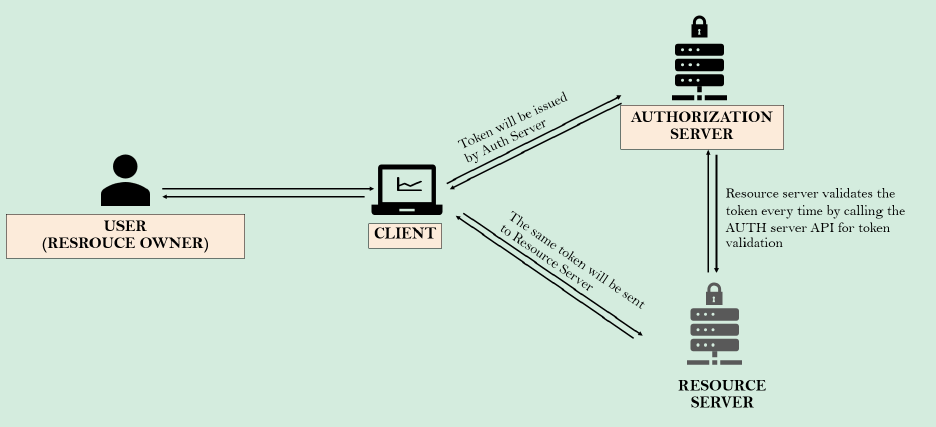

1. Usuário (proprietário do recurso)
2. Cliente
3. Servidor de Autorização
4. Servidor de Recurso

O token é emitido pelo servidor de autorização.

O mesmo token é enviado ao servidor de recursos.

O servidor de recursos valida o token toda vez chamando a API do servidor de autorização para validação do token.

Observação: Esta abordagem pode não ser a mais eficiente devido ao tráfego adicional gerado pelas chamadas de validação.

### Resource Server Token Validation in the OAuth2 flow using Common DB

(Validação de Token do Servidor de Recursos usando Banco de Dados Comum)

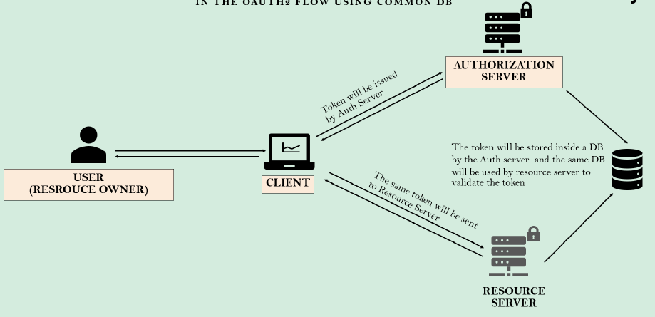

1. Usuário (proprietário do recurso)
2. Cliente
3. Servidor de Autorização
4. Servidor de Recurso
5. Banco de Dados (DB)

O token é emitido pelo servidor de autorização.

O mesmo token é enviado ao servidor de recursos.

O token é armazenado em um banco de dados pelo servidor de autorização e o mesmo banco de dados é usado pelo servidor de
recursos para validar o token.

Observação: Esta abordagem requer a sincronização do banco de dados entre o servidor de autorização e o servidor de
recursos, o que pode ser complexo de gerenciar.

### Resource Server Token Validation in the OAuth2 flow using Certificates

(Validação de Token do Servidor de Recursos usando Certificados)

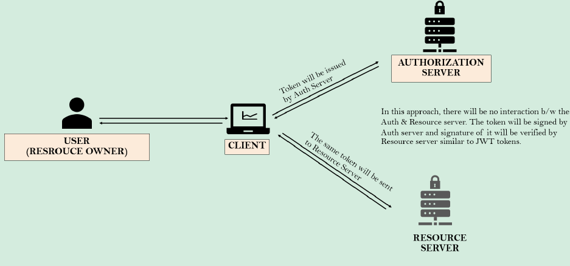

1. Usuário (proprietário do recurso)
2. Cliente
3. Servidor de Autorização
4. Servidor de Recurso

O token é emitido pelo servidor de autorização.

O mesmo token é enviado ao servidor de recursos.

Nessa abordagem, não haverá interação entre o servidor de autorização e o servidor de recursos. O token será assinado
pelo servidor de autorização e sua assinatura será verificada pelo servidor de recursos, similar aos tokens JWT.

Observação: Essa abordagem é a mais segura e eficiente, pois não requer chamadas adicionais de API ou gerenciamento
complexo do banco de dados.

## OpenID Connect

### O que é OpenID Connect?

* OpenID Connect é um protocolo baseado no framework OAuth 2.0. Enquanto o OAuth 2.0 fornece autorização através de um
  token de acesso contendo escopos, o OpenID Connect fornece autenticação introduzindo um novo token de ID que contém um
  novo conjunto de informações e declarações específicas para identidade.
* Com o token de ID, o OpenID Connect traz padrões para compartilhar detalhes de identidade entre os aplicativos.

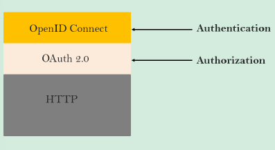

O fluxo **OpenID Connect** é parecido com o OAuth. As únicas diferenças estão na solicitação inicial, onde um escopo
específico de **openid** é usado, e na troca final, o cliente recebe um **Access Token** (token de acesso) e um **ID
Token** (Token de ID).

### Por que o OpenID Connect é importante?

* A identidade é a chave para qualquer aplicativo. No centro da autorização moderna está o OAuth 2.0, mas o OAuth 2.0
  carece de um componente de autenticação. Implementar o OpenID Connect sobre o OAuth 2.0 completa uma estratégia de
  IAM (Identity & Access Management - Gerenciamento de Identidade e Acesso).
* À medida que mais e mais aplicativos precisam se conectar entre si e mais identidades estão sendo populadas na
  internet, a demanda para compartilhar essas identidades também aumenta. Com o OpenID Connect, os aplicativos podem
  compartilhar as identidades de maneira fácil e padronizada.

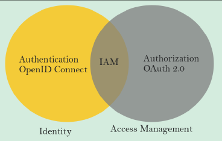

O OpenID Connect adiciona os seguintes detalhes ao OAuth 2.0:

1. OIDC padroniza os escopos para openid, profile, email e address.
2. ID Token usando o padrão JWT (JSON Web Token).
3. OIDC expõe o endpoint padronizado `/userinfo`.

## Implement OAuth2 inside EazyBanck APP using Keycloak Auth Server

1. We may have either Angular like Client App or REST API clients to get the resource details form resource server. In
   both kinds we need to get Access Token from Auth Servers like KeyCloak.
2. Once the Access Token received from Auth Server, client Apps will connect with Resource server along with the Access
   Token to get the details around Accounts, Cards, Loans etc.
3. Resource server will connect with Auth Server to know the validity of the Access Token
4. If the Access Token is valid, Resource server will respond with the details to client Apps.

### OAuth2 Auth Code Flow with Proof Key For Code Exchange (PKCE)

When public clients (e.g., native and single-page applications) request Access Tokens, some addiotional security
concerns are posed that are not mitigated by the Authorization Code Flow alone. This is because public clients cannot
securely store a Client Secret.

Given these situations, OAuth 2.0 provides a version of the Authorization Code Flow for public client applications which
makes use of a Proof Key for Code Exchange (PKCE).

The PKCE-enhanced Authorization Code Flow follows below steps:

* Once user clicks login, client app creates a cryptographically-random **code_verifier** and from this generates a *
  *code_challenge**.
* Code challenge is a Base64-URL-encoded String of the SHA256 hash of the code verifier.
* Redirects the user to the Authorization Server along with the code_challenge.
* Authorization Server stores the code_challenge and redirects the user back to the application with an authorization
  code, which is good for one use.
* Client App sends the authorization code and the code_verifier (created in step 1) to the Authorization Server.
* Authorization Server verifies the code_challenge and code_verifier. If they are valid it respond with ID Token and
  Access Token (and optionally, a Refresh Token).

## Referências

- [OAuth 2.0](https://oauth.net/2/)
- [OAuth 2.0 Playground](https://oauth.com/playground/)